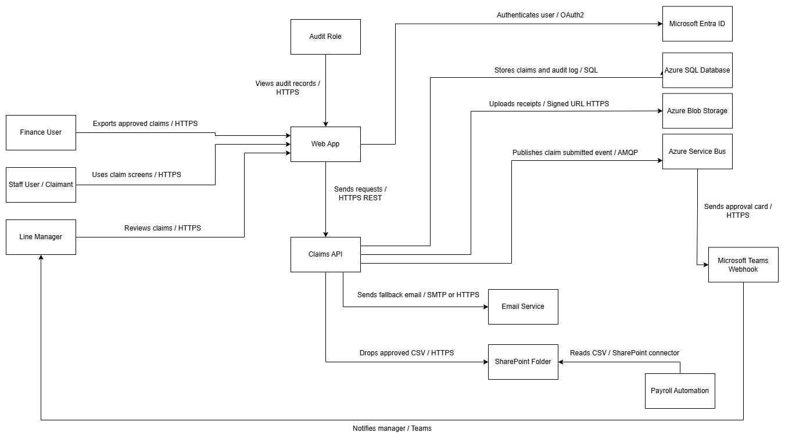
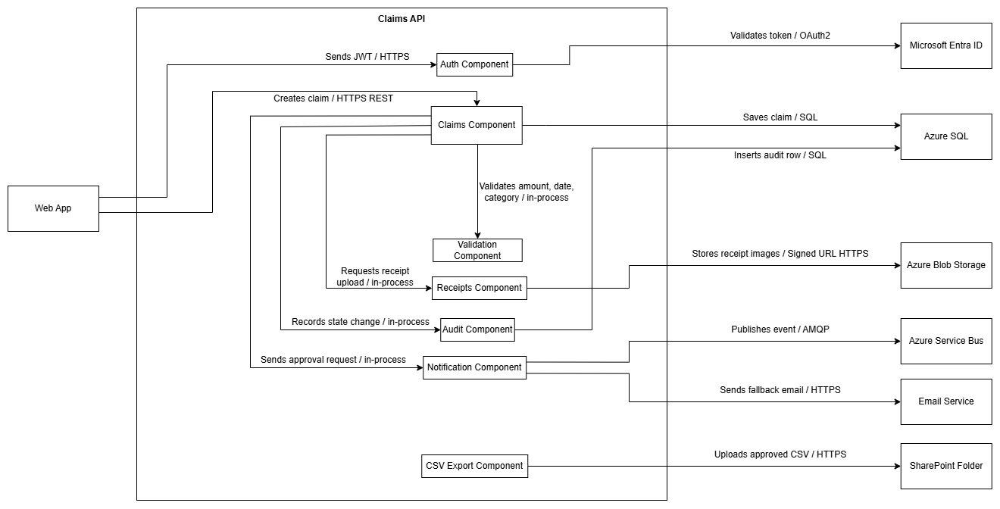

# GreenChit — Architecture Design Pack

---

# 1. System Context

GreenChit is an internal reimbursement management system used by BISTEC employees to submit expense claims with receipt images for manager approval before payroll processing. Staff members can create and track reimbursement claims, line managers can approve or reject claims, finance users can export approved claims into CSV files for payroll automation, and audit users can review claim activity for compliance purposes. The system integrates with Microsoft Entra ID for secure authentication, Azure Blob Storage for receipt uploads, Azure SQL Database for structured claim storage, Azure Service Bus for asynchronous notifications, Microsoft Teams webhook notifications for approvals, and SharePoint for payroll CSV exports.

---

# 2. Containers (C4 Level 2)

## Container Table

| Container | Responsibility |
|---|---|
| Web App | Provides user interfaces for staff, managers, finance, and audit users |
| Claims API | Handles claim processing, approvals, notifications, exports, and audit recording |
| Microsoft Entra ID | Authenticates users and manages secure access |
| Azure SQL Database | Stores claims, approvals, statuses, users, and audit records |
| Azure Blob Storage | Stores uploaded receipt images securely |
| Azure Service Bus | Handles asynchronous messaging and notification events |
| Microsoft Teams Webhook | Sends approval notifications to line managers |
| Email Service | Sends fallback email notifications |
| SharePoint Folder | Stores approved reimbursement CSV exports |
| Payroll Automation | Reads approved CSV files and processes reimbursements |

---

# 3. Components (C4 Level 3) for the API Service

## Component Table

| Component | Responsibility |
|---|---|
| Auth Component | Validates JWT tokens and authenticates users |
| Claims Component | Handles claim creation, approval, rejection, and status management |
| Validation Component | Validates claim fields such as amount, category, date, and required inputs |
| Receipts Component | Handles receipt uploads and storage operations |
| Audit Component | Records claim state transitions and audit information |
| Notification Component | Publishes notification events and sends Teams/email notifications |
| CSV Export Component | Generates approved claim CSV files and uploads them to SharePoint |

---

# 4. Reading Order

The reviewer should first read the System Context section to understand the business purpose and scope of GreenChit. Next, review the Container Diagram from left to right, starting with the user roles, followed by the Web App and Claims API, then the Azure services and external integrations. After understanding the high-level architecture, review the Component Diagram to understand the internal structure of the Claims API and how responsibilities are separated into authentication, validation, receipt handling, notifications, auditing, and export processing. Finally, follow the labeled arrows and protocols to understand how requests, storage operations, notifications, and payroll integrations flow through the system.