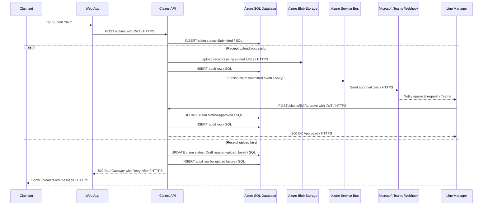

# Sequence — Submit and Approve a Claim

## Happy path and error path

## Notes

This sequence diagram shows the full submit-and-approve journey for GreenChit. The happy path starts when the claimant submits a reimbursement claim through the Web App. The Claims API stores the submitted claim, uploads receipt images to Azure Blob Storage, records an audit row, publishes a notification event to Azure Service Bus, and sends an approval request to the manager through Microsoft Teams. The manager then approves the claim, and the Claims API updates the claim status to Approved.

The error path shows what happens if receipt upload fails after the claim has already been created. In that case, the Claims API changes the claim back to Draft, records the failure in the audit log, and returns a retry message to the Web App.